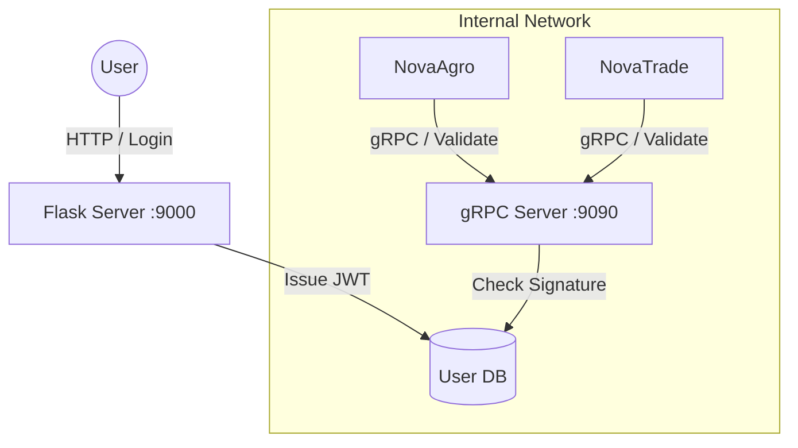

# 🔐 NovaEco Identity Service (Auth)

**The Digital Passport of the NovaEco.**
Centralized authentication (SSO), token verification, and user profile management.

## 📖 Overview

The Identity Service is the "Source of Truth" for users and permissions. It issues JWT tokens to users via a public web interface and validates those tokens for internal microservices via a high-performance gRPC channel.

**Role:** Identity Provider (IdP) & Trust Anchor
**Protocol:** Hybrid

- **HTTP (Port 9000):** For User Login, Sign-up, and OAuth2 flows.
- **gRPC (Port 9090):** For internal services (Agro, Trade) to validate tokens.

**Artifacts:** Produces the `novaeco-auth` docker image and the `novaeco-auth-client` Python/Node SDK.

## 🏗️ Architecture

We use a "Split-Face" architecture to optimize for both user accessibility and internal performance.



## 🚀 Getting Started

### Prerequisites

* Python 3.11+
* **NovaEco CLI** (`novaeco-cli`) installed via `pipx`

### Local Installation

1. Navigate to the directory:
```bash
cd auth
```


2. Install dependencies:
```bash
pip install -r requirements.txt
```


3. Run the hybrid server:
```bash
python src/main.py
```


**Endpoints:**

* HTTP: http://localhost:9000/health
* gRPC: localhost:9090

### Docker Usage

We recommend running this via the root `docker-compose.yml`.

```bash
# From repository root
docker compose up auth
```

## 📦 Client SDK Generation

Other services (like NovaAgro) cannot call the gRPC endpoint directly without the generated client code. We use the standard CLI to build this SDK.

To build the client locally:

```bash
# From the auth/ directory
novaeco build client
```

This generates a `.whl` file in `dist/client/dist/` that other services can install via pip.

## 🛳️ Service Packaging

To package the service for deployment (Docker build context):

```bash
# From the auth/ directory
novaeco build service
```

This creates a `dist/novaeco-auth.tar.gz` artifact containing the source code and locked requirements.

## 📂 Project Structure

* `src/main.py`: Entry point. Starts both Flask (Thread 1) and gRPC (Thread 2).
* `api/proto/v1/auth.proto`: The contract definition for internal validation.
* `requirements.txt`: Runtime dependencies (Flask, gRPC).
* `requirements-internal.txt`: Empty for Auth (it has no internal dependencies).

## ⚙️ Configuration

| Variable | Default | Description |
| --- | --- | --- |
| `HTTP_PORT` | 9000 | Port for REST API (Login UI). |
| `GRPC_PORT` | 9090 | Port for internal token validation. |
| `JWT_SECRET` | dev-secret | Key for signing tokens (Change in Prod!). |

## 🧪 Testing

We use Pytest for unit testing the HTTP endpoints.

```bash
# Install dev dependencies
pip install -r requirements-dev.txt

# Run tests
pytest
```