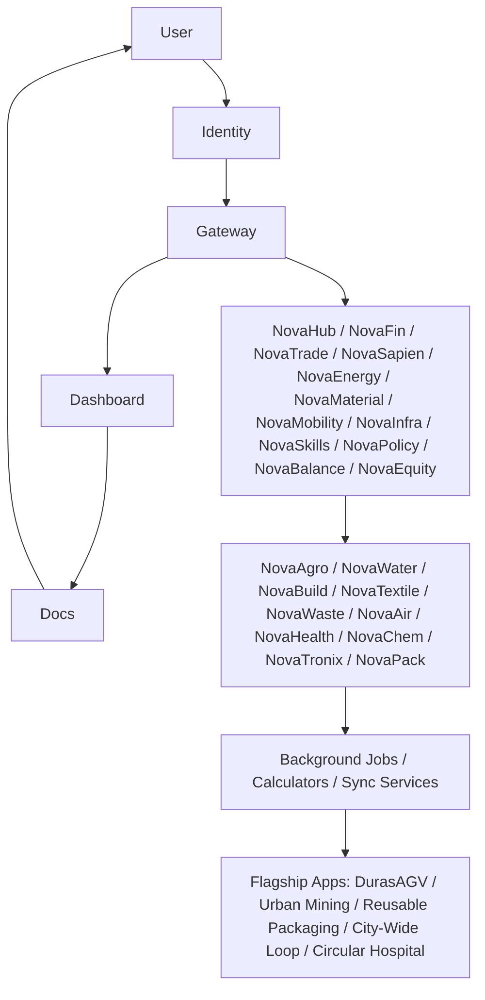

# Architecture Overview

The **NovaEco** is an open‑source operating system for the circular economy.  
It is designed as a **system‑of‑systems**: interconnected **Horizontal Enablers**, **Vertical Sectors**, **Workers**, and **Products** that together enable sustainable collaboration, compliance, and innovation.

---

## 🌐 Core Services (ecosystem-core)

At the heart of the ecosystem is the `ecosystem-core` monorepo, which contains the tightly‑coupled central services:

| Service     | Path       | Type            | Port | Public URL | Docs Reference |
|-------------|------------|-----------------|------|------------|----------------|
| **App**       | `/app`   | Python/Flask    | 5000 | [app.novaeco.tech](https://app.novaeco.tech) | [Use Cases L1](../usecases/level-1-onboarding.md) |
| **Identity**  | `/auth`  | Python/Flask    | 9000 | [auth.novaeco.tech](https://auth.novaeco.tech) | [API Auth](../api/auth.md) |
| **Gateway**   | `/api`   | Python/Flask    | 8000 | [api.novaeco.tech](https://api.novaeco.tech) | [API Gateway](../api/gateway.md) |
| **Website**   | `/website` | Node.js/Docusaurus | 3000 | [novaeco.tech](https://novaeco.tech) | [Intro](../intro.md) |

These services provide the foundation for onboarding, governance, API integration, and contributor visibility.

---

## 🧩 Horizontal Enablers

Cross‑cutting foundational services:

- **NovaHub** – innovation wizard, complex problem decomposition, orchestration.
- **NovaFin** – tokens, staking, payments, revenue sharing, investment.  
- **NovaTrade** – decentralized marketplace for goods, services, and assets.  
- **NovaSapien** – shared artificial intelligence and ML models.  
- **NovaEnergy** – renewable energy production, distribution, and auditing.  
- **NovaMaterial** – Digital Product Passports (DPPs), lifecycle tracking of raw/recycled materials.  
- **NovaMobility** – circular logistics and sustainable transport coordination.  
- **NovaInfra** – shared digital/physical infrastructure.  
- **NovaSkills** – education, skill‑sharing, labor coordination.  
- **NovaPolicy** – governance, compliance, legal frameworks.  
- **NovaBalance** – environmental auditing, proof of ecological impact.  
- **NovaEquity** – social auditing, proof of fairness and social impact.

---

## 🏭 Vertical Sectors

Industry‑specific applications that consume enabler services:

- **NovaAgro** – sustainable agriculture, bio‑nutrients, post‑harvest processing.
- **NovaWater** – water resource management, sustainable use, ecosystem restoration.
- **NovaBuild** – sustainable construction, circular building materials, built environment.  
- **NovaTextile** – lifecycle of textiles, sustainable sourcing, recycling, reuse.  
- **NovaWaste** – waste‑to‑value streams, recycling, circular waste management.  
- **NovaAir** – air quality monitoring, environmental credits.  
- **NovaHealth** – circular economy principles in healthcare and life sciences. 
- **NovaPack** – reusable and circular packaging systems, deposit models, reverse logistics, inventory management.
- **NovaTronix** – sustainable electronics and e‑waste management, modular design, repair, recycling, and material recovery.
- **NovaChem** – sustainable chemical processes, leasing models, and closed‑loop industrial chemistry.

---

## ⚙️ Workers

Decoupled, single‑purpose backend services (e.g., `novahub-worker-sync`, `novabalance-worker-impact-calculator`).  
They handle background jobs such as:

- Data ingestion and normalization  
- Automated LCA calculations  
- Compliance checks  
- Logistics optimization  

Workers are independent for scalability and fault isolation.

---

## 📦 Products

Flagship applications that consume multiple enablers and sectors:

- **DurasAGV** – autonomous logistics robots integrating AI and Agro.  
- **Urban Mining Coordination** – orchestration app combining Build, Waste, and Mobility.  
- **Reusable Packaging Systems** – products integrating Pack, Mobility, and Water.  
- **City‑Wide Loop** – unified reusable cup system across entire cities.  
- **Circular Hospital** – healthcare equipment leasing and reuse models.

---

## 👥 Main Actors

- **Contributors** – register via Identity, propose governance changes, build apps.  
- **Organizations** – manage teams, roles, and compliance dashboards.  
- **Developers** – generate API keys, integrate external systems, build sector apps.  
- **Regulators/Auditors** – use compliance dashboards, validate ESG and policy adherence.  
- **Citizens/End‑Users** – interact with apps (marketplace, dashboards, mobility services).  

---

## 🛠️ Technical Standards

To ensure scalability and decoupling, the ecosystem adheres to strict communication and interface standards:

### Communication Protocols
- **External (Public):** **REST/JSON** via the API Gateway. All 3rd-party apps and frontend clients consume this.
- **Internal (Pillar-to-Pillar):** **gRPC/ProtoBuf**. Used for high-performance, type-safe communication between Enablers and Sectors (e.g., NovaAgro API calling NovaFin API).
- **Asynchronous:** **RabbitMQ/NATS**. Used for Pillar-to-Worker tasks (e.g., triggering an LCA calculation).

### User Interface Strategy
- **Federated UIs:** Instead of a single monolithic frontend, each Pillar (NovaAgro, NovaHealth, NovaFin) hosts its own dedicated "micro-frontend" or standalone web app.
- **Unified Identity:** A seamless SSO (Single Sign-On) session persists across all domain boundaries (`*.novaeco.tech`).

---

## 🔄 Interaction Flow

1. **Onboarding**: Identity service creates Trust Profiles.  
2. **Integration**: Gateway issues API keys for external systems.  
3. **Transactions**: NovaTrade + NovaFin enable secure exchanges.  
4. **Data Aggregation**: NovaBalance + NovaMaterial + Sector workers provide sustainability metrics.  
5. **Governance**: NovaPolicy enforces rules; NovaEquity ensures fairness.  
6. **Visibility**: Dashboard aggregates results; Docs provide transparency.

---

## 📊 Diagram (Mermaid)

---

## 🌱 Principles

- **Open Source** – all repos are public, community‑driven.  
- **Transparency** – ADRs, Use Cases, Guides, and Glossary ensure clarity.  
- **Scalability** – monorepo model with containerized services.  
- **Auditability** – NovaBalance and NovaEquity enablers provide verifiable impact.  
- **Circularity** – every sector and product reinforces sustainable loops.

---

## 🔗 Related Pages

- [Intro](../intro.md)  
- [Functional Requirements](../requirements/functional.md)  
- [Non‑Functional Requirements](../requirements/non-functional.md)  
- [API Overview](../api/overview.md)  
- [Use Cases Overview](../usecases/level-1-onboarding.md)  
- [Glossary](../glossary.md)

---

[⬅️ Back to Intro](../intro.md)  
[➡️ Next: Requirements](../requirements/functional.md)
