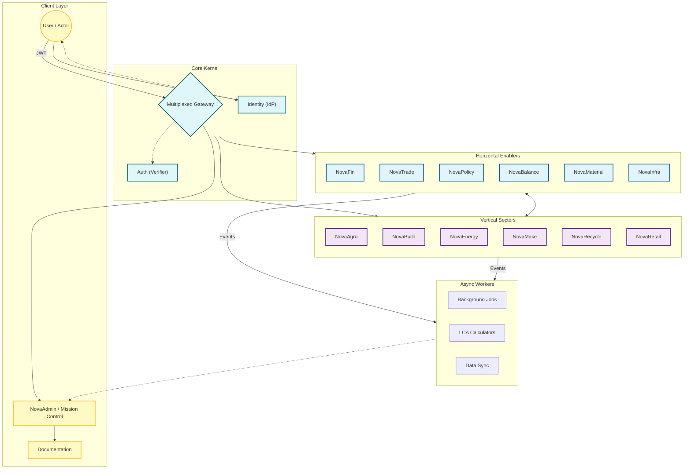

# Architecture Overview

The **NovaEco** is an open‑source operating system for the circular economy.  
It is designed as a **system‑of‑systems**: interconnected **Horizontal Enablers**, **Vertical Sectors**, **Workers**, and **Products** that together enable sustainable collaboration, compliance, and innovation.

The system is divided into **Core Kernel** (Edge), **Horizontal Enablers** (Platform), and **Vertical Sectors** (Industry).

---

## 🌐 Core Services (Kernel)

At the heart of the ecosystem is the `novaeco` monorepo, which contains the foundational plumbing:

| Service | Subdomain | Description | Docs Reference |
| :--- | :--- | :--- | :--- |
| **Gateway** | `api.novaeco.tech` | **Multiplexed Ingress.** Handles both REST (Web) and gRPC (Agents) traffic on Port 443. | [API Gateway](../api/gateway.md) |
| **Identity** | `id.novaeco.tech` | **Identity Provider.** Keycloak instance handling SSO, Sign-ups, and Token Issuance. | [API Auth](../api/auth.md) |
| **Auth** | `auth.novaeco.tech` | **Verifier Bridge.** High-speed internal service for validating tokens against cached keys. | [API Auth](../api/auth.md) |
| **Docs** | `novaeco.tech` | **Knowledge Base.** Public landing page and technical documentation hub. | [Intro](../intro.md) |

These services provide the foundation for onboarding, governance, API integration, and contributor visibility.

---

## 🧩 Horizontal Enablers

Cross‑cutting foundational services consumed by all sectors.

| Enabler | Subdomain | Description |
| :--- | :--- | :--- |
| **NovaAdmin** | `admin.novaeco.tech` | Mission Control dashboard for onboarding, discovery, and ecosystem management. |
| **NovaBalance** | `balance.novaeco.tech` | Environmental audit engine for carbon, water, and mass. |
| **NovaEquity** | `equity.novaeco.tech` | Social audit engine tracking fair wages and labor rights. |
| **NovaFin** | `finance.novaeco.tech` | Ledger for payments, staking, and ESG token settlements. |
| **NovaInfra** | `infrastructure.novaeco.tech` | Registry for IoT devices and fleet management command. |
| **NovaLogistics** | `logistics.novaeco.tech` | Optimization engine for reverse logistics and circular transport. |
| **NovaMaterial** | `materials.novaeco.tech` | Engine for Digital Product Passports and material lineage. |
| **NovaMind** | `mind.novaeco.tech` | Shared AI models and inference engine for all sectors. |
| **NovaPolicy** | `policy.novaeco.tech` | Policy-as-Code engine for automated regulatory compliance. |
| **NovaSkills** | `skills.novaeco.tech` | Verification system for human labor certifications and degrees. |
| **NovaTrade** | `trade.novaeco.tech` | Marketplace for matching orders and discovering circular assets. |

---

## 🏭 Vertical Sectors

Industry‑specific applications that consume enabler services to solve domain problems.

| Sector | Subdomain | Description |
| :--- | :--- | :--- |
| **NovaAgro** | `agriculture.novaeco.tech` | Management of regenerative agriculture and sustainable food systems. |
| **NovaAir** | `air.novaeco.tech` | Air quality monitoring and carbon capture credit verification. |
| **NovaBuild** | `build.novaeco.tech` | Management of construction lifecycles and material banks. |
| **NovaChem** | `chemicals.novaeco.tech` | Chemical leasing models and hazardous material tracking. |
| **NovaEnergy** | `energy.novaeco.tech` | Renewable grid balancing and vehicle-to-grid energy coordination. |
| **NovaMake** | `make.novaeco.tech` | Distributed manufacturing via 3D printing and CNC networks. |
| **NovaNature** | `nature.novaeco.tech` | Biodiversity monitoring and reforestation project management. |
| **NovaPack** | `packaging.novaeco.tech` | Reusable packaging systems and deposit return schemes. |
| **NovaRecycle** | `recycling.novaeco.tech` | Management of recycling centers and urban mining recovery. |
| **NovaRetail** | `retail.novaeco.tech` | Product-as-a-Service management and consumer take-back schemes. |
| **NovaTronix** | `electronics.novaeco.tech` | E-waste management and electronics repair documentation. |
| **NovaTextile** | `textiles.novaeco.tech` | Circular fashion management and fiber-to-fiber recycling loops. |
| **NovaWater** | `water.novaeco.tech` | Management of industrial water cycles and treatment systems. |

---

## ⚙️ Workers

Decoupled, single‑purpose backend services for high-throughput tasks.

| Worker | Subdomain | Description |
| :--- | :--- | :--- |
| **Quality** | `quality.air.novaeco.tech` | Ingests and normalizes data from air quality sensors. |
| **Bioacoustics** | `bio.nature.novaeco.tech` | Identifies species from audio streams using AI models. |
| **IoTIngest** | `ingest.infrastructure.novaeco.tech` | High-throughput processor for raw telemetry from sensors. |
| **LCACalc** | `lca.balance.novaeco.tech` | Calculates real-time environmental impact from material BOMs. |
| **SlicerCheck** | `slicer.make.novaeco.tech` | Verifies 3D model printability for manufacturing jobs. |
| **TradeSettlement** | `settle.finance.novaeco.tech` | Asynchronously batches and commits transactions to the ledger. |

---

## 📦 Products

Flagship applications combining multiple sectors.

| Product | Subdomain | Description |
| :--- | :--- | :--- |
| **DurasAGV** | `duras-agv.novaeco.tech` | Autonomous agricultural robot for regenerative farming tasks. |
| **NovaLab** | `lab.novaeco.tech` | Innovation engine for designing and launching circular projects. |
| **RetailLoop** | `retail-loop.novaeco.tech` | E-commerce plugin for resale and product take-back. |
| **UrbanMiner** | `urban-miner.novaeco.tech` | Dashboard for city councils to map municipal waste streams. |

---

## 👥 Main Actors

The ecosystem serves a multi-sided marketplace with distinct roles:

- **Contributors** – Participate in governance, register digital identities (DID), and propose protocol improvements.
- **Organizations** – Manage workspace teams, assign RBAC roles, and oversee compliance reporting.
- **Developers** – Integrate external systems via API keys, build vertical-specific applications, and contribute to the open-source core.
- **Regulators & Auditors** – Access read-only compliance nodes to validate ESG metrics, policy adherence, and carbon credits.
- **End-Users (Citizens)** – Engage with the ecosystem via the marketplace, mobility apps, and circular economy dashboards.

---

## 🛠️ Technical Standards

To ensure scalability, modularity, and loose coupling, the architecture enforces the following interface standards:

### Communication Protocols
- **External (Ingress):** **Multiplexed HTTP**. The Gateway (`api.novaeco.tech`) listens on Port 443 and routes traffic based on Content-Type:
    - `application/json` $\to$ **REST** (Web/Mobile Clients).
    - `application/grpc` $\to$ **gRPC** (High-Performance Agents/IoT).
- **Inter-Service (Synchronous):** **gRPC/ProtoBuf**. Used for low-latency communication between Core Enablers (e.g., Gateway calling Auth Verifier).
- **Event-Driven (Asynchronous):** **NATS JetStream**. Used for decoupling domains (e.g., `order.placed` triggers `logistics.schedule`) and offloading heavy computations.

### User Interface Strategy
- **Federated UI:** Domain-specific UIs (e.g., *NovaAgro Dashboard*) are independent apps stitched together via the **NovaAdmin** Launchpad.
- **Unified Identity:** A seamless Single Sign-On (SSO) session persists across all subdomains using OpenID Connect (OIDC).

---

## 🔄 Interaction Flow

1. **Identity & Trust**: User logs in via `id.novaeco.tech` (Keycloak) and receives a signed JWT.
2. **Access Control**: The **Gateway** receives the request, calls **Auth Verifier** (gRPC) to validate the token, and routes to the target service.
3. **Value Exchange**: **NovaTrade** and **NovaFin** execute atomic transactions (financial or tokenized assets).
4. **Impact Calculation**: As transactions occur, **NovaBalance** and background workers aggregate sustainability metrics.
5. **Governance Checks**: **NovaPolicy** intercepts sensitive actions to enforce community-voted rules.
6. **Visualization**: Aggregated data is pushed to **NovaAdmin** for transparency.

---

## 🌱 Principles

  - **Open Source** – all repos are public, community‑driven.
  - **Transparency** – ADRs, Use Cases, Guides, and Glossary ensure clarity.
  - **Scalability** – federated monorepo with containerized services.
  - **Auditability** – NovaBalance and NovaEquity enablers provide verifiable impact.
  - **Circularity** – every sector and product reinforces sustainable loops.

---

## 🔗 Related Pages

  - [Intro](../intro.md)
  - [Functional Requirements](../requirements/functional.md)
  - [Non‑Functional Requirements](../requirements/non-functional.md)
  - [API Overview](../api/overview.md)
  - [Use Cases Overview](../usecases/tier-1-onboarding.md)
  - [Glossary](../glossary.md)
