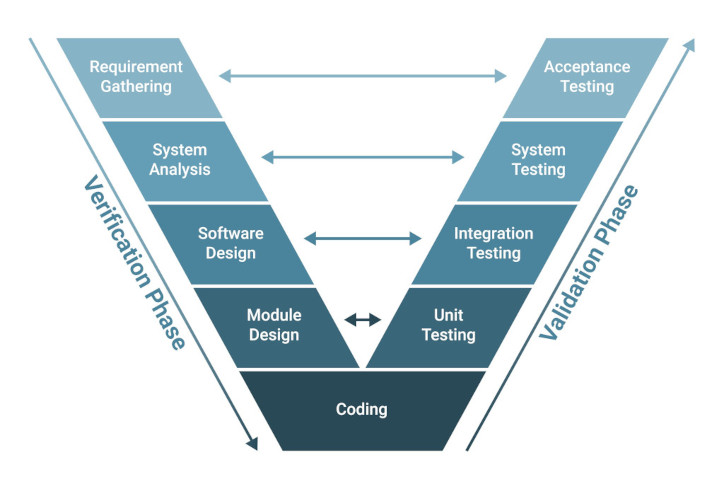

# V-Model & Requirements Engineering

**How we translate user needs into verified code.** A comprehensive guide to the V-Model, testing strategies, and requirements traceability in the NovaEco System-of-Systems.

---

## 📖 The Philosophy: The 5-Level V-Model

NovaEco uses a **5-Level V-Model** to manage complexity. This structure separates **Definition** (designing the right thing) from **Verification** (building the thing right).

Crucially, verification happens in two distinct scopes:
1.  **Local Scope (Levels 3-5):** Executed inside individual repositories (e.g., `novaagro`, `novaeco`). Verifies that the component functions correctly in isolation.
2.  **Global Scope (Levels 1-2):** Executed inside `novaeco-qa`. Verifies that components interact correctly as a System-of-Systems.



---

## Level 1: Systemic Needs (Acceptance)

**Scope:** The entire ecosystem working in concert to solve a real-world problem. 

**Goal:** Verify that multiple sectors (Enablers + Verticals) can coordinate to achieve a user outcome.

* **Definition (Left Side):**
    * **Artifact:** Global Use Cases.
    * **Location:** `novaeco/website/docs/usecases/level-4-complex.md`
    * *Example:* `[C1] City Challenge` (Waste + Logistics + Finance).

* **Verification (Right Side):**
    * **Test Type:** System Acceptance Tests (End-to-End).
    * **Location:** `novaeco-qa/tests/level4_complex/`
    * *Execution:* Runs against the full production-like cluster.

---

## Level 2: System Requirements (Integration)

**Scope:** Interactions between two or more specific services via network protocols.

**Goal:** Verify contracts, latency constraints, and data flow between containers.

* **Definition (Left Side):**
    * **Artifact:** Functional Requirements (Inter-service).
    * **Location:** `[repo]/website/docs/requirements/functional.md`
    * *Example:* `REQ-AGRO-FUNC-001` "Agro API must query Mind API for image analysis."

* **Verification (Right Side):**
    * **Test Type:** Global Integration Tests.
    * **Location:** `novaeco-qa/tests/level2_easy/` & `level3_medium/`
    * *Execution:* Real traffic (gRPC/REST) between Docker containers.

---

## Level 3: Component E2E (System E2E)

**Scope:** The user interface or entry point of a single component, treated as a "Black Box."

**Goal:** Verify that the application launches, renders, and handles user input correctly before backend logic is involved.

* **Definition (Left Side):**
    * **Artifact:** User Interface & Experience Specs.
    * **Location:** `[repo]/website/docs/requirements/non-functional.md` (Usability section).

* **Verification (Right Side):**
    * **Test Type:** Local E2E / UI Tests (Playwright/Cypress/Selenium).
    * **Location:** `[repo]/tests/e2e/`
    * *Execution:* Runs in the repository's CI pipeline using mocked backends or stubbed data.

| Component | Concrete Example File | Purpose |
| :--- | :--- | :--- |
| **NovaEco Core** | `novaeco/tests/e2e/test_homepage.py` | Verifies the "Mission Control" dashboard renders and Launchpad links exist. |
| **NovaAgro** | `novaagro/tests/e2e/test_homepage.spec.ts` | Verifies the Farmer Dashboard map loads and controls are interactive. |

---

## Level 4: Service Integration (Component Integration)

**Scope:** The internal plumbing of a monorepo. Verifying that the API service connects to its Auth middleware, Database, or internal gRPC clients.

**Goal:** Verify the service "stands up" and respects its internal architecture.

* **Definition (Left Side):**
    * **Artifact:** API Specifications (OpenAPI / Proto).
    * **Location:** `[repo]/api/proto/v1/`

* **Verification (Right Side):**
    * **Test Type:** Local Integration Tests.
    * **Location:** `[repo]/tests/integration/`
    * *Execution:* Runs via `docker-compose` in the repository's CI pipeline.

| Component | Concrete Example File | Purpose |
| :--- | :--- | :--- |
| **NovaEco Core** | `novaeco/tests/integration/test_core_flows.py` | Verifies the API Gateway container correctly routes requests to the Auth container. |
| **NovaAgro** | `novaagro/tests/integration/test_auth_flow.py` | Verifies the Agro API container successfully validates a token against a (mocked) Auth service. |

---

## Level 5: Implementation (Unit)

**Scope:** Individual functions, classes, and modules within a specific service.

**Goal:** Verify logic correctness, edge cases, and error handling. External dependencies (DB, Network) are **always mocked**.

* **Definition (Left Side):**
    * **Artifact:** Technical Design / Code Comments.
    * **Location:** Source code docstrings.

* **Verification (Right Side):**
    * **Test Type:** Unit Tests.
    * **Location:** Co-located with the source code service folder.
    * *Execution:* Runs via `pytest` or `npm test` instantly.

| Service Type | Location Pattern |
| :--- | :--- |
| **Python APIs** | `[repo]/api/tests/` (e.g., `novaagro/api/tests/test_calculations.py`) |
| **Web Apps** | `[repo]/app/tests/` (e.g., `novaeco/app/tests/test_routes.py`) |
| **Workers** | `[repo]/tests/` (Workers are single-folder structures) |
| **Auth Service** | `novaeco/auth/tests/` |

---

## 🔗 Traceability & Auditing

To ensure strict alignment between **Definition** and **Verification**, we use specific tagging and auditing tools.

### 1. The Requirement ID
Every requirement defined in `docs/` must be assigned a unique ID.
* **Format:** `REQ-{COMPONENT}-{CATEGORY}-{ID}`
* **Example:** `REQ-AGRO-FUNC-005`

### 2. The Test Tag
Every test in `novaeco-qa` (Levels 1-2) must tag which requirement it verifies.

```python
import pytest

@pytest.mark.requirement("REQ-AGRO-FUNC-005")
def test_nitrogen_calculation():
    # ...
````

### 3\. The Audit Command

The `novaeco-devtools` CLI provides a command to generate the **Traceability Matrix**.

```bash
novaeco audit traceability
```

**Output:**

```text
[PASS] REQ-AGRO-FUNC-005: Verified by tests/level2_easy/test_agro.py
[FAIL] REQ-AGRO-FUNC-006: No verification found in novaeco-qa.
```
